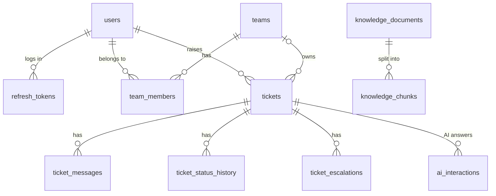

# Database

**PostgreSQL 17 + pgvector** in Docker. Python talks to it through **SQLAlchemy 2** (driver: psycopg 3).
Every change to the tables goes through an Alembic migration: see [migrations.md](migrations.md).

| Database | Used by |
|---|---|
| `support` | The app |
| `support_test` | pytest only (created automatically the first time the container starts) |

The backend builds the connection from `POSTGRES_USER`, `POSTGRES_PASSWORD`, `POSTGRES_HOST`,
`POSTGRES_PORT`, `POSTGRES_DB` in `.env`. The same values set up the Docker container, so the password is written only once.

## Tables

| Table | What it stores | Important columns |
|---|---|---|
| `users` | Accounts | `email` (unique, lowercase), `password_hash` (Argon2), `role`, `is_active` |
| `refresh_tokens` | Active login sessions | `token_hash` (SHA-256, unique), `expires_at` |
| `teams` | Support groups | `name` (unique), `is_active` |
| `team_members` | Who is in which team | (`team_id`, `user_id`) primary key, `is_lead` |
| `tickets` | Customer problems | `number` (1001, 1002, …), `subject`, `status`, `priority`, `category`, `customer_id`, `team_id`, `assignee_id` |
| `ticket_messages` | The conversation | `body`, `is_internal` (staff-only note) |
| `ticket_status_history` | Every status change | `from_status`, `to_status`, `changed_by_id` (empty = system), `reason` |
| `knowledge_documents` | Uploaded help documents | `title` (from the `# heading`), `filename`, `content` (cleaned text), `status` (PROCESSING / READY / FAILED), `chunk_count`, `error` |
| `knowledge_chunks` | Pieces of documents, for search | `chunk_index`, `content`, **`embedding vector(768)`** (HNSW index, cosine) |
| `ai_interactions` | Every AI answer about a ticket | `status` (OK / INVALID_OUTPUT / UNAVAILABLE), `result` (JSON), `confidence`, `applied`, `decision` (what the code did), `model`, `prompt_version`, `latency_ms` |
| `ticket_escalations` | Escalations | `reason`, `raised_by_id` (empty = system, e.g. the SLA check), `resolved_by_id`, `resolved_at` |

## Design choices

| Choice | Why |
|---|---|
| **UUID** ids | Can't be guessed or counted. Tickets also get a short `number` for people ("ticket 1042") |
| `role`, `status`, `priority`, `category` stored as **text + CHECK constraint** | The database itself rejects unknown values, and adding a value later is a small migration |
| Users are **deactivated**, not deleted | Their tickets and messages still point at them |
| `ON DELETE CASCADE` from tickets to messages/history | Deleting a ticket removes its conversation too |
| Indexes on `tickets(customer_id)`, `tickets(team_id, status)`, `tickets(assignee_id)` | Match the three common lists: my tickets, team queue, agent's tickets |
| Event times use `clock_timestamp()` | `now()` is the start of the transaction; two events saved together would get the same time and the timeline could mix up |
| **pgvector** `vector(768)` column + **HNSW** index | Stores embeddings next to the data they describe; the index finds the nearest chunks without comparing against every row |

## Code

| File | Contains |
|---|---|
| `app/db/base.py` | `Base` for all tables, constraint naming, `enum_column()` / `one_of()` helpers |
| `app/db/session.py` | `get_engine()` (connection pool) and `get_db()` (one session per request) |
| `app/models/*.py` | The table classes |
